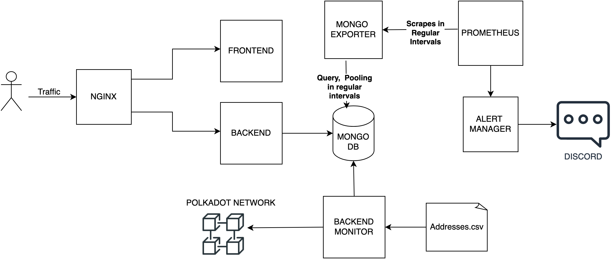

# Polkadot Observer

This project aims to provide a robust solution for observing the [Polkadot network](https://www.polkadot.network/) and detecting when a specific account fund goes under a user-defined threshold. The system is  designed to be deployed on a Kubernetes platform and offers features  like Prometheus queryable metrics, making it suitable for monitoring and alerting purposes.

## Architecture Overview


## How to run

### Docker-compose

1. **OPTIONAL**: Open the file ./dev/docker-compose.yaml, you need to change 2 environment variables 

   - Looking at service backend_monitor, you can change the env 'CHAIN_URI' to one of the node endpoints offered [at this link](https://wiki.polkadot.network/docs/maintain-endpoints) to choose at which network  you wanna listen to.

   - If you want to send the alert to Discord, it needs to know the [webhook url](https://support.discord.com/hc/en-us/articles/228383668-Intro-to-Webhooks), so go to service alert_manager, and you will find:

       ```
               receivers:
                   - name: discord
                   discord_configs:
                       - webhook_url: 'TO-CHANGE'
   
2. From the terminal, go in the folder ./dev and run:

    ``` docker-compose up --build```

3. Wait until all the services are up and running and you can connect to the system: http://localhost:3000/, from there you can insert the addresses to monitor and the thresholds 

    

**NOTE**: If you do not want to add the list manually from the frontend, you can do  so through .csv file that is pre-loaded once the service backendMonitor is started, go in the folder backendMonitor and edit the file 'addresses.csv', with the format 'address,threshold', for instance: ```14gAowz3LaAqYkRjqUZkjZUxKFUzLtN2oZJSfr3ziHBRhwgc,2```


### Run On K8S Locally


1. **OPTIONAL**: 

   - In the folder ./k8s, in the file monitoring-deployment.yaml at service called alert-manager-container, If you want to send the alert to discord, it needs to know the webhook ur l( [how to set a webhook](https://support.discord.com/hc/en-us/articles/228383668-Intro-to-Webhooks)), so go at service alert_manager, and you will find:

     ```
                 receivers:
                   - name: discord
                     discord_configs:
                       - webhook_url: 'TO-CHANGE'
     ```


   - In the file backend-monitor-deployment:

     ```
     name: CHAIN_URI
                   value: TO-CHANGE
     ```

     you can change the env 'CHAIN_URI' to one of the node endpoints offered [at this link](https://wiki.polkadot.network/docs/maintain-endpoints) to choose at which network  you wanna listen.

     If you want to make use of the addresses.csv in backendMonitor, you can change this env with your absolute path to this file:

     ```
           - name: local-files
               hostPath:
                 path: TO_CHANGE
     ```

     

2. After the env are set, you need to install [Ingress-Nginx-Controller](https://kubernetes.github.io/ingress-nginx/deploy/#quick-start) 

3. Type from terminal: 

   ```
   helm upgrade mongodb-query-exporter --install oci://ghcr.io/raffis/charts/mongodb-query-exporter --set 'mongodb[0]=mongodb://mongodb-cluster-ip-service:27017' --set 'service.enabled=true' --set-file config=./mongoExporter/config.yaml
   ```

4. Type: ```kubectl apply -f ./k8s```

5. WAIT A MINUTE OR MORE, THE SERVICES NEED TO START (It requires more time if is the first time you have installed Ingress-Nginx-Controller ).

6. Now if you have docker desktop you can access localhost:80 and see the dashboard otherwise type minikube ip to retrieve the IP and type it in your browser. If doesn't work, try to restart the cluster or docker desktop.

## Style Guides

- [Git style guide](./doc/style/git-style-guide.md)
- [Ember style guide](./doc/style/ember-style-guide.md)
- [General javascript style guide](./doc/style/ember-style-guide.md)

